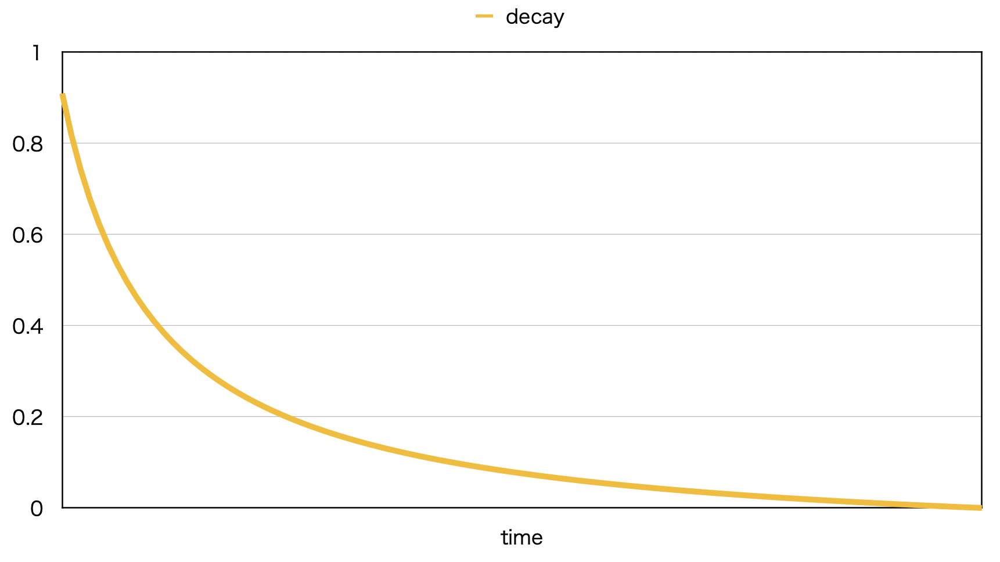

# [traveling-salesman-problem](https://traveling-salesman-probl-885eb.firebaseapp.com/)


## What
[巡回セールスマン問題](https://ja.wikipedia.org/wiki/%E5%B7%A1%E5%9B%9E%E3%82%BB%E3%83%BC%E3%83%AB%E3%82%B9%E3%83%9E%E3%83%B3%E5%95%8F%E9%A1%8C)を[自己組織化マップ](https://ja.wikipedia.org/wiki/%E8%87%AA%E5%B7%B1%E7%B5%84%E7%B9%94%E5%8C%96%E5%86%99%E5%83%8F)を用いて短時間でそれらしい経路を求めるプログラムです。

## Demo

1. [デモページ](https://traveling-salesman-probl-885eb.firebaseapp.com/)を開きます。
1. 任意の場所(背景色がグレーの領域内)をクリックし、都市(赤い四角)を配置します。

* 都市を2つ以上配置すると経路を導き始めます。
* 青い線は、経路です。
  * リアルタイムで変化します。
  * 都市を追加する度に経路はリセットされます。
  * 最初から試す場合は画面をリロードします(手抜きですみません)。
* 緑色の背景は、プログレスバーを表現しています。
  * 都市数が少ない場合、進捗率が100%に達する前に経路が収束します。
  * 進捗率100%になると、経路の更新は終了します。


## アルゴリズム説明

### 概要
都市数以上のセル(点)を任意の場所に配置します。全てのセルを順に結んだ線が経路になります。 
少数のルールでセルの位置調整を繰り返すことで、徐々に最短経路に近づけていきます。

### セルの初期配置
このプログラムでは、都市数の3倍のセルを配置します。
セルを配置した順に結んで仮の経路を引きます(最後のセルと最初のセルも結びます)。

セルの位置が偏らないように全領域(背景色がグレーの部分)の中心に円の存在をイメージし、その円周上にセルが等間隔に並ぶように配置します。
セルの初期配置による結果の違いは掘り下げていません。


### セルの位置調整ルール
各都市について、最も近いセルをその都市に近づけます。
また、同セルの近隣セルも同都市に近づけます。
経路が収束するまで、全ての都市に対して上記ルールによるセルの位置調整を繰り返します。

セルの位置は序盤に大きく調整して、徐々に微調整をして収束させます。
具体的には、時間経過に応じて
1. セルが移動する距離を短くします。
1. 都市から最も近いセルに対して位置調整をする近隣セルの数を減らします。

セルの位置が変わってもセルを結ぶ順番は不変です。
言い方を変えると、セル同士の前後関係はそれらの位置に依存しません。


### 実装の要点

自己組織化マップの実装は[KohonenMap.vue](https://github.com/watanabe200ok/traveling-salesman-problem/blob/master/src/components/KohonenMap.vue)です。

定数の値の多くは、直感的に調整しました。詳細は割愛します。

以下、肝となる関数を抜粋して説明します。

* 時間経過によって減衰する汎用的な係数を求める関数

  ```JavaScript
  decay (time) {
    const MIN = DECAY_PARAM / (DECAY_PARAM + MAX_TIME)
    return DECAY_PARAM / (DECAY_PARAM + time) - MIN
  },
  ```

  戻り値は、次のグラフのように時間経過によって減衰します。
　

* 都市から最も近いセルを基準として何個隣のセルまで位置調整をするかを求める関数

  ```JavaScript
  range (decay) {
    return ~~(this.cellSize * decay)
  },
  ```

  前後それぞれこの関数で求めた数のセルの位置調整をします。
  引数`decay`は`decay`関数で求めた値です。

  **前後それぞれ**なので、最後に2で割らないと各都市について同一セルの位置を2回調整する場合があり(引数decayが0.5以上となる序盤)、直感的に2で割るべきなのではないかと思います。
  
  実験したところ、最後に2で割ると、少なくとも都市数が2の場合の経路が正しく収束しません。
  都市数による場合分けをしなくても特に問題を検出できなかったので、現在の実装にしました。


* 都市とセル間の距離に掛ける係数を求める関数

  ```JavaScript
  tension (decay, range, index) {
    const tension = BASE_TENSION + BASE_TENSION_RATIO * decay
    return range > 0 ? tension * (1.0 - index / range) : tension
  }
  ```

  引数`decay`は`decay`関数で求めた値、引数`range`は`range`関数で求めた値、引数`index`は計算対象の都市から最も近いセルを基準として何個隣かを受け取ります。
  
  あるセルの位置調整におけるセルの移動距離は次の通りです。
 
  ```
  セルの移動距離 = 都市とセル間の距離 * この関数の戻り値
  ```

  この関数の戻り値は、
  1. 時間経過に応じて減衰します。
  1. 基準となるセルから(順序が)離れているほど小さくなります。


## Project setup
```
yarn install
```

### Compiles and hot-reloads for development
```
yarn serve
```

### Compiles and minifies for production
```
yarn build
```
